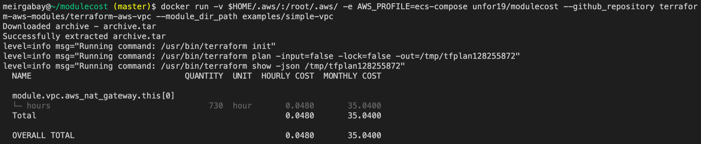

# modulecost

Calculate Terraform modules cost, implemented with [infracost](https://github.com/infracost/infracost)



## Requirements

- [Docker](https://docs.docker.com/get-docker/)

## Getting Started

To see all available commands

```bash
docker run --rm unfor19/modulecost --help
```

### Credentials file

```bash
docker run -v $HOME/.aws/:/root/.aws/ \
    -e AWS_PROFILE=default \
    --rm \
    unfor19/modulecost --github_repository terraform-aws-modules/terraform-aws-vpc -p examples/simple-vpc
```

Copy-Paste

```bash
docker run -v $HOME/.aws/:/root/.aws/ -e AWS_PROFILE=default unfor19/modulecost --github_repository terraform-aws-modules/terraform-aws-vpc --module_dir_path examples/simple-vpc
```

### Environment Variables

```bash
docker run \
    -e AWS_ACCESS_KEY_ID \
    -e AWS_SECRET_ACCESS_KEY \
    -e AWS_SESSION_TOKEN \
    --rm \
    unfor19/modulecost --github_repository terraform-aws-modules/terraform-aws-vpc -p examples/simple-vpc
```

Copy-Paste

```bash
docker run -e AWS_ACCESS_KEY_ID -e AWS_SECRET_ACCESS_KEY -e AWS_SESSION_TOKEN  --rm unfor19/modulecost --github_repository terraform-aws-modules/terraform-aws-vpc -p examples/simple-vpc
```

## Authors

Created and maintained by [Meir Gabay](https://github.com/unfor19)
